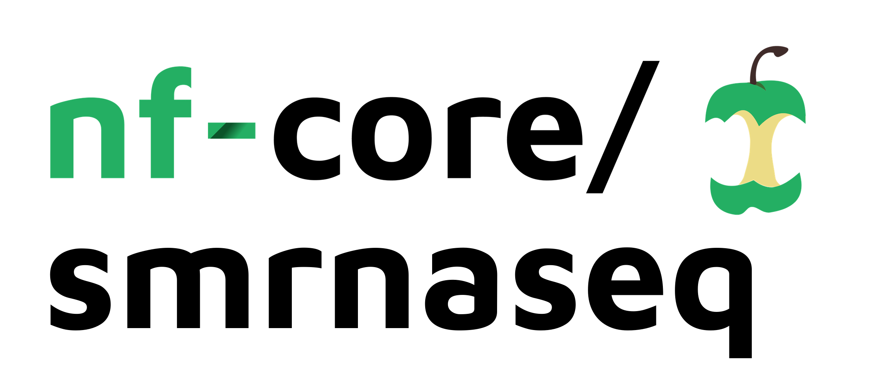

# 

[](https://github.com/nf-core/smrnaseq/actions)
[](https://github.com/nf-core/smrnaseq/actions)
[](https://www.nextflow.io/)

[](https://bioconda.github.io/)
[](https://hub.docker.com/r/nfcore/smrnaseq)
[](https://nfcore.slack.com/channels/smrnaseq)

[](https://zenodo.org/badge/latestdoi/140590861)

## Introduction

**nf-core/smrnaseq** is a bioinformatics best-practice analysis pipeline used for small RNA sequencing data.

The pipeline is built using [Nextflow](https://www.nextflow.io), a workflow tool to run tasks across multiple compute infrastructures in a very portable manner. It comes with docker containers making installation trivial and results highly reproducible.

## Quick Start

1. Install [`nextflow`](https://nf-co.re/usage/installation) (`>=20.04.0`)

2. Install any of [`Docker`](https://docs.docker.com/engine/installation/), [`Singularity`](https://www.sylabs.io/guides/3.0/user-guide/), [`Podman`](https://podman.io/), [`Shifter`](https://nersc.gitlab.io/development/shifter/how-to-use/) or [`Charliecloud`](https://hpc.github.io/charliecloud/) for full pipeline reproducibility _(please only use [`Conda`](https://conda.io/miniconda.html) as a last resort; see [docs](https://nf-co.re/usage/configuration#basic-configuration-profiles))_

3. Download the pipeline and test it on a minimal dataset with a single command:

    ```bash
    nextflow run nf-core/smrnaseq -profile test,<docker/singularity/podman/shifter/charliecloud/conda/institute>
    ```

    > Please check [nf-core/configs](https://github.com/nf-core/configs#documentation) to see if a custom config file to run nf-core pipelines already exists for your Institute. If so, you can simply use `-profile <institute>` in your command. This will enable either `docker` or `singularity` and set the appropriate execution settings for your local compute environment.

4. Start running your own analysis!

    ```bash
    nextflow run nf-core/smrnaseq -profile <docker/singularity/podman/shifter/charliecloud/conda/institute> --input '*_R{1,2}.fastq.gz' --genome GRCh37
    ```

See [usage docs](https://nf-co.re/smrnaseq/usage) for all of the available options when running the pipeline.

## Pipeline summary

1. Raw read QC ([`FastQC`](https://www.bioinformatics.babraham.ac.uk/projects/fastqc/))
2. Adapter trimming ([`Trim Galore!`](https://www.bioinformatics.babraham.ac.uk/projects/trim_galore/))
    1. Insert Size calculation
    2. Collapse reads ([`seqcluster`](https://seqcluster.readthedocs.io/mirna_annotation.html#processing-of-reads))
3. Alignment against miRBase mature miRNA ([`Bowtie1`](http://bowtie-bio.sourceforge.net/index.shtml))
4. Alignment against miRBase hairpin
    1. Unaligned reads from step 3 ([`Bowtie1`](http://bowtie-bio.sourceforge.net/index.shtml))
    2. Collapsed reads from step 2.2 ([`Bowtie1`](http://bowtie-bio.sourceforge.net/index.shtml))
5. Post-alignment processing of miRBase hairpin
    1. Basic statistics from step 3 and step 4.1 ([`SAMtools`](https://sourceforge.net/projects/samtools/files/samtools/))
    2. Analysis on miRBase hairpin counts  ([`edgeR`](https://bioconductor.org/packages/release/bioc/html/edgeR.html))
         * TMM normalization and a table of top expression hairpin
         * MDS plot clustering samples
         * Heatmap of sample similarities
    3. miRNA and isomiR annotation from step 4.1 ([`mirtop`](https://github.com/miRTop/mirtop))
6. Alignment against host reference genome ([`Bowtie1`](http://bowtie-bio.sourceforge.net/index.shtml))
    1. Post-alignment processing of alignment against host reference genome ([`SAMtools`](https://sourceforge.net/projects/samtools/files/samtools/))
7. Novel miRNAs and known miRNAs discovery ([`MiRDeep2`](https://www.mdc-berlin.de/content/mirdeep2-documentation))
    1. Mapping against reference genome with the mapper module
    2. Known and novel miRNA discovery with the mirdeep2 module
8. miRNA quality control ([`mirtrace`](https://github.com/friedlanderlab/mirtrace))
9. Present QC for raw read, alignment, and expression results ([`MultiQC`](http://multiqc.info/))

## Documentation

The nf-core/smrnaseq pipeline comes with documentation about the pipeline: [usage](https://nf-co.re/smrnaseq/usage) and [output](https://nf-co.re/smrnaseq/output).

## Credits

nf-core/smrnaseq was originally written for use at the [National Genomics Infrastructure](https://portal.scilifelab.se/genomics/) at [SciLifeLab](http://www.scilifelab.se/) in Stockholm, Sweden, by Phil Ewels (@ewels), Chuan Wang (@chuan-wang) and Rickard Hammarén (@Hammarn). Updated by Lorena Pantano (@lpantano) from MIT.

## Contributions and Support

If you would like to contribute to this pipeline, please see the [contributing guidelines](.github/CONTRIBUTING.md).

For further information or help, don't hesitate to get in touch on the [Slack `#smrnaseq` channel](https://nfcore.slack.com/channels/smrnaseq) (you can join with [this invite](https://nf-co.re/join/slack)).

## Citations

You can cite the `nf-core` publication as follows:

> **The nf-core framework for community-curated bioinformatics pipelines.**
>
> Philip Ewels, Alexander Peltzer, Sven Fillinger, Harshil Patel, Johannes Alneberg, Andreas Wilm, Maxime Ulysse Garcia, Paolo Di Tommaso & Sven Nahnsen.
>
> _Nat Biotechnol._ 2020 Feb 13. doi: [10.1038/s41587-020-0439-x](https://dx.doi.org/10.1038/s41587-020-0439-x).

In addition, references of tools and data used in this pipeline are as follows:
