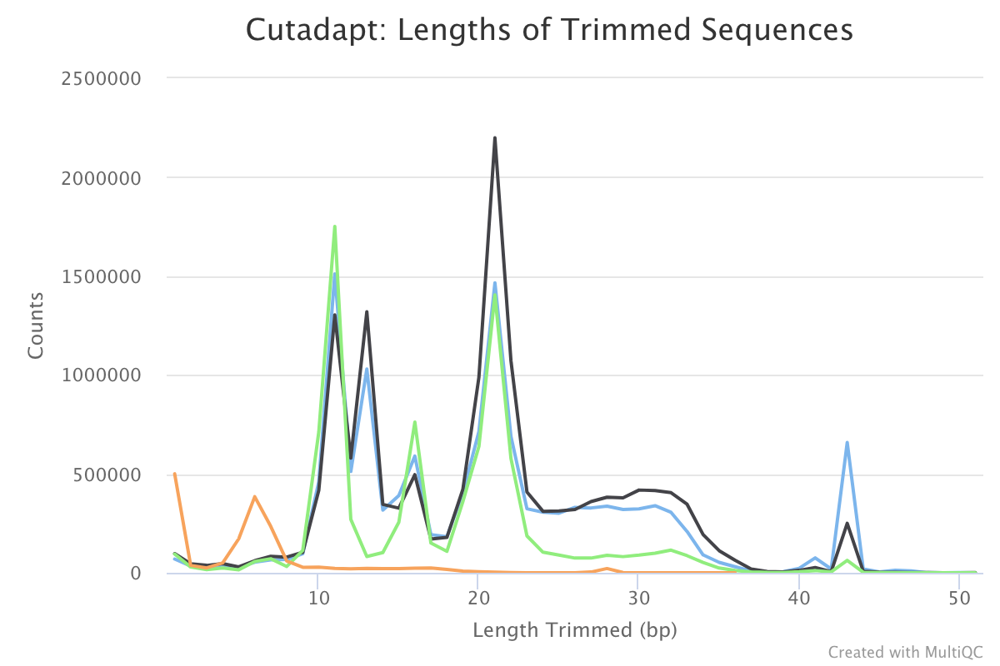
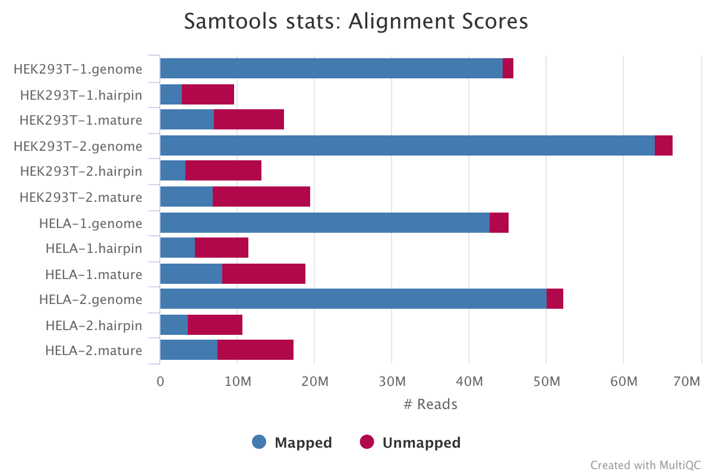
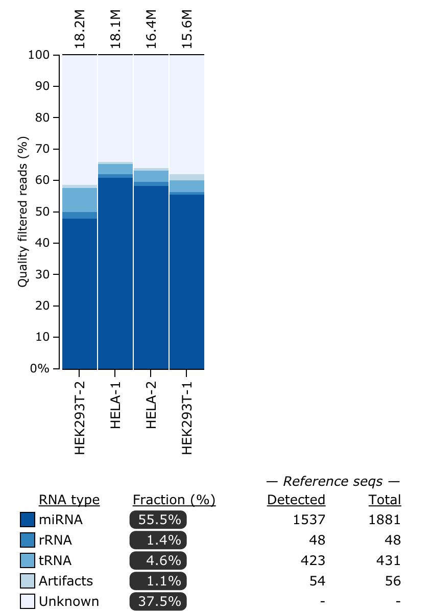

# nf-core/smrnaseq Output

**nf-core/smrnaseq** is a bioinformatics best-practice analysis pipeline used for small RNA sequencing data analysis.

This document describes the output produced by the pipeline. Most of the plots are taken from the MultiQC report, which summarises results at the end of the pipeline.

## Pipeline overview

The pipeline is built using [Nextflow](https://www.nextflow.io/)
and processes data using the following steps:

* [FastQC](#fastqc) - read quality control
* [TrimGalore](#trimgalore) - adapter trimming
* [Bowtie](#bowtie) - alignment against mature miRNAs and miRNA precursors (hairpins)
* [SAMtools](#samtools) - alignment result processing and feature counting
* [edgeR](#edger) - normalization, MDS plot and sample pairwise distance heatmap
* [Bowtie](#bowtie) - alignment against reference genome for QC purpose
* [mirtop](#mirtop) - miRNA and isomiR annotation
* [miRDeep2](#mirdeep2) - known and novel miRNA annotation
* [miRTrace](#mirtrace) - a comprehensive tool for QC purpose
* [MultiQC](#multiqc) - aggregate report, describing results of the whole pipeline

## FastQC

[FastQC](http://www.bioinformatics.babraham.ac.uk/projects/fastqc/) gives general quality metrics about your reads. It provides information about the quality score distribution across your reads, the per base sequence content (%T/A/G/C). You get information about adapter contamination and other overrepresented sequences.

For further reading and documentation see the [FastQC help](http://www.bioinformatics.babraham.ac.uk/projects/fastqc/Help/).

> **NB:** The FastQC plots displayed in the MultiQC report shows _untrimmed_ reads. They may contain adapter sequence and potentially regions with low quality. To see how your reads look after trimming, look at the FastQC reports in the `trim_galore` directory.

**Output directory: `results/fastqc`**

* `sample_fastqc.html`
  * FastQC report, containing quality metrics for your untrimmed raw fastq files
* `sample_fastqc.zip`
  * zip file containing the FastQC report, tab-delimited data file and plot images

## TrimGalore

[TrimGalore](http://www.bioinformatics.babraham.ac.uk/projects/trim_galore/) is used for removal of adapter contamination and trimming of low quality regions. TrimGalore uses [Cutadapt](https://github.com/marcelm/cutadapt) for adapter trimming and runs FastQC after it finishes.

MultiQC reports the percentage of bases removed by TrimGalore in the _General Statistics_ table, along with a line plot showing where reads were trimmed.

**Output directory: `results/trim_galore`**

Contains FastQ files with quality and adapter trimmed reads for each sample, along with a log file describing the trimming.

* `sample_trimmed.fq.gz`
  * Trimmed FastQ data
* `sample.fastq.gz_trimming_report.txt`
  * Trimming report (describes which parameters that were used)
* `sample_trimmed_fastqc.html`
* `sample_trimmed_fastqc.zip`
  * FastQC report for trimmed reads

This is an example of the output we can get:

## Bowtie - miRNAs

[Bowtie](http://bowtie-bio.sourceforge.net/index.shtml) is used for mapping adapter trimmed reads against the mature miRNAs and miRNA precursors (hairpins) in [miRBase](http://www.mirbase.org/).

**Output directory: `results/bowtie`**

* `miRBase_mature/sample.mature.bam`
  * The aligned BAM file of alignment against mature miRNAs
* `miRBase_mature/sample.mature_unmapped.fq.gz`
  * Unmapped reads against mature miRNAs *This file will be used as input for the alignment against miRNA precursors (hairpins)*
* `miRBase_hairpin/sample.hairpin.bam`
  * The aligned BAM file of alignment against miRNA precursors (hairpins)
* `miRBase_hairpin/sample.hairpin_unmapped.fq.gz`
  * Unmapped reads against miRNA precursors (hairpins)

## SAMtools

[SAMtools](http://samtools.sourceforge.net/) is used for sorting and indexing the output BAM files from Bowtie. In addition, the numbers of features are counted with the `idxstats` option.

**Output directory: `results/bowtie`**

* `miRBase_mature/sample.mature.stats|idxstats|flagstat`
  * Raw mapped read counts and stats of mature miRNAs
* `miRBase_mature/sample.mature.sorted.bam`
  * The sorted BAM file of alignment against mature miRNAs
* `miRBase_mature/sample.mature.sorted.bam.bai`
  * The index file of alignment against mature miRNAs
* `miRBase_hairpin/sample.hairpin.stats|idxstats|flagstat`
  * Raw mapped read counts and stats of miRNA precursors (hairpins)
* `miRBase_hairpin/sample.hairpin.sorted.bam`
  * The sorted BAM file of alignment against miRNA precursors (hairpins)
* `miRBase_hairpin/sample.hairpin.sorted.bam.bai`
  * The index file of alignment against miRNA precursors (hairpins)

## edgeR

[edgeR](https://bioconductor.org/packages/release/bioc/html/edgeR.html) is an R package used for differential expression analysis of RNA-seq expression profiles.

**Output directory: `results/edgeR`**

* `[mature/hairpin]_normalized_CPM.txt`
  * TMM normalized counts of reads aligned to mature miRNAs/miRNA precursors (hairpins)
* `[mature/hairpin]_edgeR_MDS_plot.pdf`
  * Multidimensional scaling plot of all samples based on the expression profile of mature miRNAs/miRNA precursors (hairpins)
* `[mature/hairpin]_CPM_heatmap.pdf`
  * Heatmap based on the expression profile of mature miRNAs/miRNA precursors (hairpins)
* `[mature/hairpin]_log2CPM_sample_distances_dendrogram.pdf`
  * Dendrograms of distance among samples based on the expression profile of mature miRNAs/miRNA precursors (hairpins)
* `[mature/hairpin]_log2CPM_sample_distances_heatmap.pdf`
  * Pairwise correlation of samples based on the expression profile of mature miRNAs/miRNA precursors (hairpins)

**Example**: MDS plot of 10 samples based on their expression profiles of mature miRNAs. Here we can see that samples cluster based on different sample types and library preparation kits.

**Example**: Heatmap of tumor and normal samples based on the top differentially expressed mature miRNAs.

## Bowtie - QC

[Bowtie](http://bowtie-bio.sourceforge.net/index.shtml) is used for mapping adapter trimmed reads against the reference genome for quality control purposes.

**Output directory: `results/bowtie_ref`**

* `sample.genome.bam`
  * The aligned BAM file against reference genome
* `sample.genome.stats|idxstats|flagstat`
  * Raw mapped read counts and stats of mature miRNAs

## mirtop

[mirtop](https://github.com/miRTop/mirtop) is used to parse the BAM files from `bowtie` alignment, and produce a [mirgff3](https://github.com/miRTop/mirGFF3) file with information about miRNAs and isomirs.

**Output directory: `results/mirtop`**

* `mirtop.gff`: [mirgff3](https://github.com/miRTop/mirGFF3) file
* `mirtop.tsv`: tabular file of the previous file for easy integration with downstream analysis.
* `mirtop_rawData.tsv`: File compatible with [isomiRs](http://lpantano.github.io/isomiRs/reference/IsomirDataSeqFromMirtop.html) Bioconductor package to perform isomiRs analysis.
* `mirna.tsv`: tabular file with miRNA counts after summarizing unique isomiRs for each miRNA

## miRDeep2

[miRDeep2](https://www.mdc-berlin.de/content/mirdeep2-documentation) is used for the identification of novel and known miRNAs in deep sequencing data.

**Output directory: `results/mirdeep2`**

* `mirdeep/timestamp_sample.bed`
  * File with the known and novel miRNAs in bed format.
* `mirdeep/timestamp_sample.csv`
  * File with an overview of all detected miRNAs (known and novel) in csv format.
* `mirdeep/timestamp_sample.html`
  * A HTML report with an overview of all detected miRNAs (known and novel) in html format.

## miRTrace

[miRTrace](https://github.com/friedlanderlab/mirtrace) is a quality control specifically for small RNA sequencing data (smRNA-Seq). Each sample is characterized by profiling sequencing quality, read length, sequencing depth and miRNA complexity and also the amounts of miRNAs versus undesirable sequences (derived from tRNAs, rRNAs and sequencing artifacts).

**Output directory: `results/miRTrace`**

* `mirtrace-report.html`
  * An interactive HTML report summarizing all output statistics from miRTrace
* `mirtrace-results.json`
  * A JSON file with all output statistics from miRTrace
* `mirtrace-stats-*.tsv`
  * Tab-separated statistics files
* `qc_passed_reads.all.collapsed`
  * FASTA file per sample with sequence reads that passed QC in miRTrace
* `qc_passed_reads.rnatype_unknown.collapsed`
  * FASTA file per sample with unknown reads in the RNA type analysis

Refer to the [tool manual](https://github.com/friedlanderlab/mirtrace/blob/master/release-bundle-includes/manual.pdf) for detailed specifications about output files. Here is an example of the RNA types plot that you will see:

## MultiQC

[MultiQC](http://multiqc.info) is a visualisation tool that generates a single HTML report summarising all samples in your project. Most of the pipeline QC results are visualised in the report and further statistics are available in within the report data directory.

The pipeline has special steps which allow the software versions used to be reported in the MultiQC output for future traceability.

**Output directory: `results/multiqc`**

* `Project_multiqc_report.html`
  * MultiQC report - a standalone HTML file that can be viewed in your web browser
* `Project_multiqc_data/`
  * Directory containing parsed statistics from the different tools used in the pipeline

For more information about how to use MultiQC reports, see [http://multiqc.info](http://multiqc.info)
