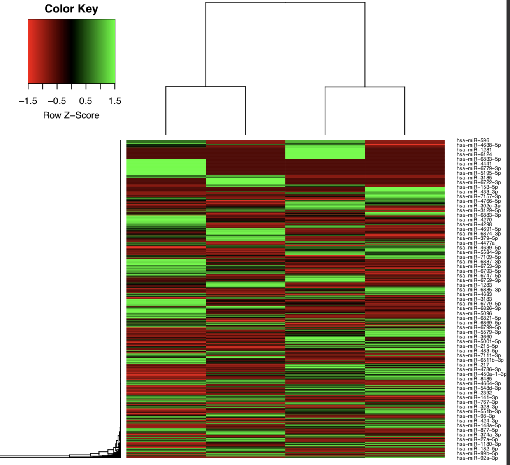
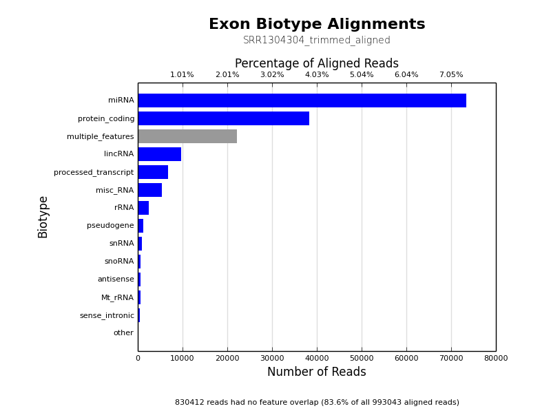
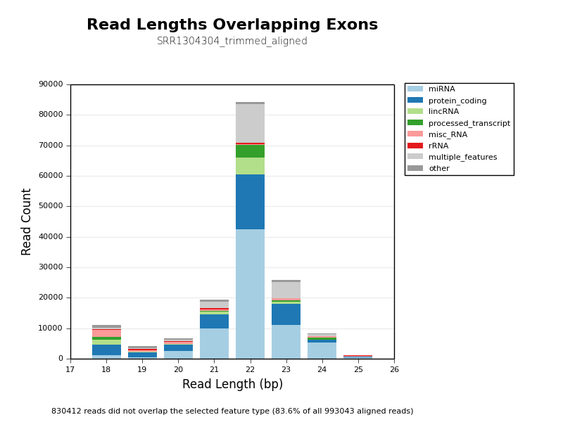

# NGI-smRNAseq Output

**NGI-smRNAseq** is a bioinformatics best-practice analysis pipeline used for small RNA sequencing data analysis at the [National Genomics Infastructure](https://ngisweden.scilifelab.se/) at [SciLifeLab Stockholm](https://www.scilifelab.se/platforms/ngi/), Sweden.

This document describes the output produced by the pipeline.

## Pipeline overview:
The pipeline is built using [Nextflow](https://www.nextflow.io/)
and processes data using the following steps:

* [FastQC](#fastqc) - read quality control
* [TrimGalore](#trimgalore) - adapter trimming
* [Bowtie](#bowtie) - alignment against mature miRNAs and miRNA precursors (hairpins)
* [SAMtools](#samtools) - alignment result processing and feature counting
* [edgeR](#edger) - normalization, MDS plot and sample pairwise distance heatmap
* [Bowtie2](#bowtie2) - alignment against reference genome for QC purpose
* [NGI-Visualizations](#ngi_visualizations) - summary of biotypes based on Bowtie2 alignment results
* [MultiQC](#multiqc) - aggregate report, describing results of the whole pipeline

## FastQC
[FastQC](http://www.bioinformatics.babraham.ac.uk/projects/fastqc/) gives general quality metrics about your reads. It provides information about the quality score distribution across your reads, the per base sequence content (%T/A/G/C). You get information about adapter contamination and other overrepresented sequences.

For further reading and documentation see the [FastQC help](http://www.bioinformatics.babraham.ac.uk/projects/fastqc/Help/).

> **NB:** The FastQC plots displayed in the MultiQC report shows _untrimmed_ reads. They may contain adapter sequence and potentially regions with low quality. To see how your reads look after trimming, look at the FastQC reports in the `trim_galore` directory.

**Output directory: `results/fastqc`**

* `sample_fastqc.html`
  * FastQC report, containing quality metrics for your untrimmed raw fastq files
* `sample_fastqc.zip`
  * zip file containing the FastQC report, tab-delimited data file and plot images

## TrimGalore
[TrimGalore](http://www.bioinformatics.babraham.ac.uk/projects/trim_galore/) is used for removal of adapter contamination and trimming of low quality regions. TrimGalore uses [Cutadapt](https://github.com/marcelm/cutadapt) for adapter trimming and runs FastQC after it finishes.

MultiQC reports the percentage of bases removed by TrimGalore in the _General Statistics_ table, along with a line plot showing where reads were trimmed.

**Output directory: `results/trim_galore`**

Contains FastQ files with quality and adapter trimmed reads for each sample, along with a log file describing the trimming.

* `sample_trimmed.fq.gz`
  * Trimmed FastQ data
* `sample.fastq.gz_trimming_report.txt`
  * Trimming report (describes which parameters that were used)
* `sample_trimmed_fastqc.html`
* `sample_trimmed_fastqc.zip`
  * FastQC report for trimmed reads

## Bowtie
[Bowtie](http://bowtie-bio.sourceforge.net/index.shtml) is used for mapping adapter trimmed reads against the mature miRNAs and miRNA precursors (hairpins) in [miRBase](http://www.mirbase.org/).

**Output directory: `results/bowtie`**

* `miRBase_mature/sample.mature.bam`
  * The aligned BAM file of alignment against mature miRNAs
* `miRBase_mature/sample.mature_unmapped.fq.gz`
  * Unmapped reads against mature miRNAs *This file will be used as input for the alignment against miRNA precursors (hairpins)*
* `miRBase_hairpin/sample.hairpin.bam`
  * The aligned BAM file of alignment against miRNA precursors (hairpins)
* `miRBase_hairpin/sample.hairpin_unmapped.fq.gz`
  * Unmapped reads against miRNA precursors (hairpins)

## SAMtools
[SAMtools](http://samtools.sourceforge.net/) is used for sorting and indexing the output BAM files from Bowtie. In addition, the numbers of features are counted with the `idxstats` option.

**Output directory: `results/bowtie`**

* `miRBase_mature/sample.mature.count`
  * Raw mapped read counts of mature miRNAs
* `miRBase_mature/sample.mature.sorted.bam`
  * The sorted BAM file of alignment against mature miRNAs
* `miRBase_mature/sample.mature.sorted.bam.bai`
  * The index file of alignment against mature miRNAs
* `miRBase_hairpin/sample.hairpin.count`
  * Raw mapped read counts of miRNA precursors (hairpins)
* `miRBase_hairpin/sample.hairpin.sorted.bam`
  * The sorted BAM file of alignment against miRNA precursors (hairpins)
* `miRBase_hairpin/sample.hairpin.sorted.bam.bai`
  * The index file of alignment against miRNA precursors (hairpins)

## edgeR
[edgeR](https://bioconductor.org/packages/release/bioc/html/edgeR.html) is an R package used for differential expression analysis of RNA-seq expression profiles.

**Output directory: `results/edgeR`**

* `[mature/hairpin]_normalized_CPM.txt`
  * TMM normalized counts of reads aligned to mature miRNAs/miRNA precursors (hairpins)
* `[mature/hairpin]_edgeR_MDS_plot.pdf`
  * Multidimensional scaling plot of all samples based on the expression profile of mature miRNAs/miRNA precursors (hairpins)
* `[mature/hairpin]_CPM_heatmap.pdf`
  * Heatmap based on the expression profile of mature miRNAs/miRNA precursors (hairpins)
* `[mature/hairpin]_log2CPM_sample_distances_dendrogram.pdf`
  * Dendrograms of distance among samples based on the expression profile of mature miRNAs/miRNA precursors (hairpins)
* `[mature/hairpin]_log2CPM_sample_distances_heatmap.pdf`
  * Pairwise correlation of samples based on the expression profile of mature miRNAs/miRNA precursors (hairpins)

**Example**: MDS plot of 10 samples based on their expression profiles of mature miRNAs. Here we can see that samples cluster based on different sample types and library preparation kits.

**Example**: Heatmap of tumor and normal samples based on the top differentially expressed mature miRNAs.

## Bowtie2
[Bowtie2](http://bowtie-bio.sourceforge.net/bowtie2/index.shtml) is used for mapping adapter trimmed reads against the reference genome for quality control purposes.

**Output directory: `results/bowtie2`**

* `sample.bowite2.bam`
  * The aligned BAM file of alignment against reference genome

## NGI-Visualizations
[NGI-Visualizations](https://github.com/NationalGenomicsInfrastructure/ngi_visualizations) takes the aligned BAM file against reference genome as input, and counts the overlaps with different biotype flags within a GTF annotation file.

**Output directory: `results/bowtie2/ngi_visualizations`**

* `sample.bowite2_biotypeCounts.pdf/png`
  * Summary of annotation categories of aligned reads
* `sample.bowite2_biotypeCounts_log.pdf/png`
  * Summary of annotation categories of aligned reads in logarithm scale
* `sample.bowite2_biotypeLengths.pdf/png`
  * Stacked bar plot of annotations of aligned reads with different read lengths  
* `sample.bowite2_biotypeLengthPercentages.pdf/png`
  * Stacked bar plot of annotation percentage of aligned reads with different read lengths  

**Example**: Summary of annotation categories of aligned reads

**Example**: Stacked bar plot of annotations of aligned reads with different read lengths

## MultiQC
[MultiQC](http://multiqc.info) is a visualisation tool that generates a single HTML report summarising all samples in your project. Most of the pipeline QC results are visualised in the report and further statistics are available in within the report data directory.

**Output directory: `results/MultiQC`**

* `multiqc_report.html`
  * MultiQC report - a standalone HTML file that can be viewed in your web browser
* `multiqc_data/`
  * Directory containing parsed statistics from the different tools used in the pipeline

For more information about how to use MultiQC reports, see http://multiqc.info

-----------------------------------------------------------------------------------------

