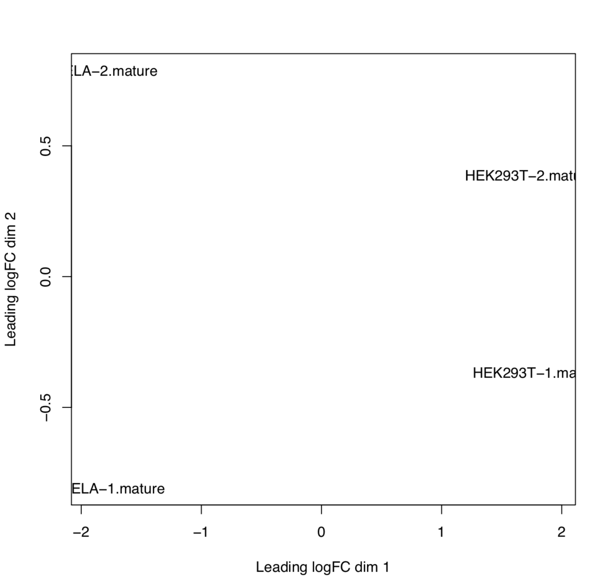

# nf-core/smrnaseq Output

## Introduction

**nf-core/smrnaseq** is a bioinformatics best-practice analysis pipeline used for small RNA sequencing data analysis.

This document describes the output produced by the pipeline. Most of the plots are taken from the MultiQC report, which summarises results at the end of the pipeline.

The directories listed below will be created in the results directory after the pipeline has finished. All paths are relative to the top-level results directory.

## Pipeline overview

The pipeline is built using [Nextflow](https://www.nextflow.io/) and processes data using the following steps:

- [FastQC](#fastqc) - read quality control
- [UMI-tools extract](#umi-tools-extract) - UMI barcode extraction
- [UMI-collapse deduplicate](#umicollapse-deduplicate) - read deduplication
- [FastP](#fastp) - adapter trimming
- [Bowtie2](#bowtie2) - contamination filtering
- [Bowtie](#bowtie) - alignment against mature miRNAs and miRNA precursors (hairpins)
- [SAMtools](#samtools) - alignment result processing and feature counting
- [edgeR](#edger) - normalization, MDS plot and sample pairwise distance heatmap
- [Bowtie](#bowtie) - alignment against reference genome for QC purpose
- [mirtop](#mirtop) - miRNA and isomiR annotation
- [miRDeep2](#mirdeep2) - known and novel miRNA annotation
- [miRTrace](#mirtrace) - a comprehensive tool for QC purpose
- [MultiQC](#multiqc) - aggregate report, describing results of the whole pipeline
- [Pipeline information](#pipeline-information) - Report metrics generated during the workflow execution

If `--save_intermediates` is specified, intermediate files generated by each process will be saved in the output directory.

### FastQC

Output files

- `fastqc/`
  - `*_fastqc.html`: FastQC report containing quality metrics.
  - `*_fastqc.zip`: Zip archive containing the FastQC report, tab-delimited data file and plot images.

[FastQC](http://www.bioinformatics.babraham.ac.uk/projects/fastqc/) gives general quality metrics about your sequenced reads. It provides information about the quality score distribution across your reads, per base sequence content (%A/T/G/C), adapter contamination and overrepresented sequences. For further reading and documentation see the [FastQC help pages](http://www.bioinformatics.babraham.ac.uk/projects/fastqc/Help/).

## UMI-tools extract

Output files

- `umitools/`
  - `*.fastq.gz`: If `--save_umi_intermeds` is specified, FastQ files **after** UMI extraction will be placed in this directory.
  - `*.log`: Log file generated by the UMI-tools `extract` command.

[UMI-tools](https://github.com/CGATOxford/UMI-tools) extracts UMIs from reads based on unique molecular identifiers (UMIs) to address PCR-bias. Firstly, the UMI-tools `extract` command removes the UMI barcode information from the read sequence and adds it to the read name. Secondly, reads are deduplicated based on UMI identifier after mapping as highlighted in the [UMI-collapse deduplicate](#umicollapse-deduplicate) section.

To facilitate processing of input data which has the UMI barcode already embedded in the read name from the start, `--skip_umi_extract` can be specified in conjunction with `--with_umi`.

## FastP

[FastP](https://github.com/OpenGene/fastp) is used for removal of adapter contamination and trimming of low quality regions.

MultiQC reports the percentage of bases removed by FastP in the _General Statistics_ table, along some further information on the results.

**Output directory: `results/fastp`**

Contains FastQ files with quality and adapter trimmed reads for each sample, along with a log file describing the trimming.

- `sample_fastp.json` - JSON report file with information on parameters and trimming metrics
- `sample_fastp.html` - HTML report with some visualizations of trimming metrics

FastP can automatically detect adapter sequences when not specified directly by the user - the pipeline also comes with a feature and a supplied miRNA adapters file to ensure adapters auto-detected are more accurate. If there are needs to add more known miRNA adapters to this list, please open a pull request.

## UMI-collapse deduplicate

Output files

- `umi_dedup/`
  - `*.log`: Results statistics files detailing the UMI deduplication results.
  - `*.fastq.gz`: If `--save_umi_intermeds` is specified, the deduplicated fastq.gz files **after** UMI deduplication will be placed in this directory.
  

[UMI-tools](https://github.com/CGATOxford/UMI-tools) deduplicates reads based on unique molecular identifiers (UMIs) to address PCR-bias. Firstly, the UMI-tools `extract` command removes the UMI barcode information from the read sequence and adds it to the read name as highlighted in the [UMI-tools extract](#umi-tools-extract) section. Umicollapse works directly on the fastq files instead of mapping the UMI data first, then deduplicating and generating fastq files again.

## Bowtie2

[Bowtie2](http://bowtie-bio.sourceforge.net/bowtie2/index.shtml) is used to align the reads to user-defined databases of contaminants.

MultiQC reports the number of reads that were removed by each of the contaminant databases.

## Bowtie

[Bowtie](http://bowtie-bio.sourceforge.net/index.shtml) is used for mapping adapter trimmed reads against the mature miRNAs and miRNA precursors (hairpins) of the chosen database [miRBase](http://www.mirbase.org/) or [MirGeneDB](https://mirgenedb.org/).

**Output directory: `results/samtools`**

- `sample_mature.bam`: The aligned BAM file of alignment against mature miRNAs
- `sample_mature_unmapped.fq.gz`: Unmapped reads against mature miRNAs _This file will be used as input for the alignment against miRNA precursors (hairpins)_
- `sample_mature_hairpin.bam`: The aligned BAM file of alignment against miRNA precursors (hairpins) that didn't map to the mature
- `sample_mature_hairpin_unmapped.fq.gz`: Unmapped reads against miRNA precursors (hairpins)
- `sample_mature_hairpin_genome.bam`: The aligned BAM file of alignment against that didn't map to the precursor.

If `--save_intermediates` is specified, these files will be placed in this directory.

## SAMtools

[SAMtools](http://samtools.sourceforge.net/) is used for sorting and indexing the output BAM files from Bowtie. In addition, the numbers of features are counted with the `idxstats` option.

**Output directory: `results/samtools/samtools_stats`**

- `stats|idxstats|flagstat`: BAM stats for each of the files listed above.

## edgeR

[edgeR](https://bioconductor.org/packages/release/bioc/html/edgeR.html) is an R package used for differential expression analysis of RNA-seq expression profiles.

**Output directory: `results/edgeR`**

- `[mature/hairpin]_normalized_CPM.txt` TMM normalized counts of reads aligned to mature miRNAs/miRNA precursors (hairpins)
- `[mature/hairpin]_edgeR_MDS_plot.pdf` Multidimensional scaling plot of all samples based on the expression profile of mature miRNAs/miRNA precursors (hairpins)
- `[mature/hairpin]_CPM_heatmap.pdf` Heatmap based on the expression profile of mature miRNAs/miRNA precursors (hairpins)
- `[mature/hairpin]_log2CPM_sample_distances_dendrogram.pdf` Dendrograms of distance among samples based on the expression profile of mature miRNAs/miRNA precursors (hairpins)
- `[mature/hairpin]_log2CPM_sample_distances_heatmap.pdf` Pairwise correlation of samples based on the expression profile of mature miRNAs/miRNA precursors (hairpins)

**Example**: MDS plot of 10 samples based on their expression profiles of mature miRNAs. Here we can see that samples cluster based on different sample types and library preparation kits.

**Example**: Heatmap of tumor and normal samples based on the top differentially expressed mature miRNAs.

## mirtop

[mirtop](https://github.com/miRTop/mirtop) is used to parse the BAM files from `bowtie` alignment, and produce a [mirgff3](https://github.com/miRTop/mirGFF3) file with information about miRNAs and isomirs.

**Output directory: `results/mirtop`**

- `gff/{sample.id}.gff`: [mirgff3](https://github.com/miRTop/mirGFF3) file
- `joined_samples_mirtop.tsv`: tabular file of the previous file for easy integration with downstream analysis.
- `export/{sample.id}_mirtop_rawData.tsv`: File compatible with [isomiRs](http://lpantano.github.io/isomiRs/reference/IsomirDataSeqFromMirtop.html) Bioconductor package to perform isomiRs analysis.
- `mirna.tsv`: tabular file with miRNA counts after summarizing unique isomiRs for each miRNA

## miRDeep2

[miRDeep2](https://www.mdc-berlin.de/content/mirdeep2-documentation) is used for the identification of novel and known miRNAs in deep sequencing data.

**Output directory: `results/mirdeep2`**

- `mirdeep/timestamp_sample.bed` File with the known and novel miRNAs in bed format.
- `mirdeep/timestamp_sample.csv` File with an overview of all detected miRNAs (known and novel) in csv format.
- `mirdeep/timestamp_sample.html` A HTML report with an overview of all detected miRNAs (known and novel) in html format.

## miRTrace

[miRTrace](https://github.com/friedlanderlab/mirtrace) is a quality control specifically for small RNA sequencing data (smRNA-Seq). Each sample is characterized by profiling sequencing quality, read length, sequencing depth and miRNA complexity and also the amounts of miRNAs versus undesirable sequences (derived from tRNAs, rRNAs and sequencing artifacts). By default, the pipeline sets the PHRED-offset to the most common +33, so if you need to adjust this, use the `params.phred_offset` option to include this accordingly for your FASTQ files.

**Output directory: `results/mirtrace/${sample.id}`**

- `mirtrace-report.html` An interactive HTML report summarizing all output statistics from miRTrace
- `mirtrace-results.json` A JSON file with all output statistics from miRTrace
- `mirtrace-stats-*.tsv` Tab-separated statistics files
- `qc_passed_reads.all.collapsed` FASTA file per sample with sequence reads that passed QC in miRTrace
- `qc_passed_reads.rnatype_unknown.collapsed` FASTA file per sample with unknown reads in the RNA type analysis

Refer to the [tool manual](https://github.com/friedlanderlab/mirtrace/blob/master/release-bundle-includes/manual.pdf) for detailed specifications about output files. Here is an example of the RNA types plot that you will see:

## MultiQC

:::note
The FastQC plots displayed in the MultiQC report shows _untrimmed_ reads. They may contain adapter sequence and potentially regions with low quality.
:::

### MultiQC

Output files

- `multiqc/`
  - `multiqc_report.html`: a standalone HTML file that can be viewed in your web browser.
  - `multiqc_data/`: directory containing parsed statistics from the different tools used in the pipeline.
  - `multiqc_plots/`: directory containing static images from the report in various formats.

[MultiQC](http://multiqc.info) is a visualization tool that generates a single HTML report summarising all samples in your project. Most of the pipeline QC results are visualised in the report and further statistics are available in the report data directory.

Results generated by MultiQC collate pipeline QC from supported tools e.g. FastQC. The pipeline has special steps which also allow the software versions to be reported in the MultiQC output for future traceability. For more information about how to use MultiQC reports, see <http://multiqc.info>.

- Note: There may be a discrepancy in read counts number displayed in MultiQC between the original FASTQ and BAM files, this is due to secondary alignments being reported by the aligner, which can inflate the total read count number in the BAM files. [More info about this behavior can be found here](https://github.com/nf-core/smrnaseq/issues/94).

### Pipeline information

Output files

- `pipeline_info/`
  - Reports generated by Nextflow: `execution_report.html`, `execution_timeline.html`, `execution_trace.txt` and `pipeline_dag.dot`/`pipeline_dag.svg`.
  - Reports generated by the pipeline: `pipeline_report.html`, `pipeline_report.txt` and `software_versions.yml`. The `pipeline_report*` files will only be present if the `--email` / `--email_on_fail` parameter's are used when running the pipeline.
  - Reformatted samplesheet files used as input to the pipeline: `samplesheet.valid.csv`.
  - Parameters used by the pipeline run: `params.json`.

[Nextflow](https://www.nextflow.io/docs/latest/tracing.html) provides excellent functionality for generating various reports relevant to the running and execution of the pipeline. This will allow you to troubleshoot errors with the running of the pipeline, and also provide you with other information such as launch commands, run times and resource usage.
